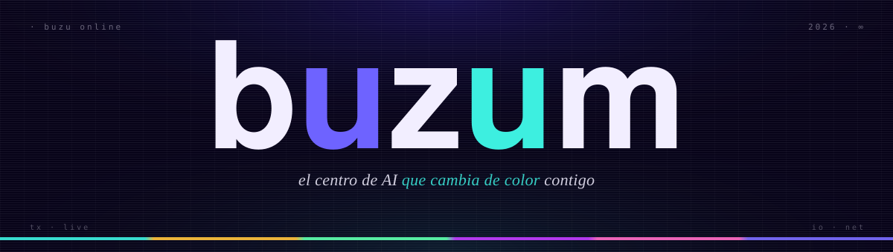
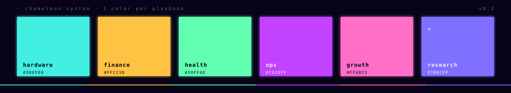

<!-- buzum brand v0.2 · palette: ink #070318 · indigo #4B3DFF · turquesa #3DEFE0 · chameleon ×6 -->

  

## · en residencia

Una sola AI. Adopta forma según el playbook. Construida y probada en mi propia casa antes de venderla a nadie.

Hoy corriendo 24/7 sobre una **Raspberry Pi 5** en Buenos Aires:

| módulo | estado | qué hace |
|---|---|---|
|  |  | signals 24/7 · watchdog SL/TP · 9 agentes CrewAI · framework O&D/gaps/fibonacci |
|  |  | RAG sobre vault Obsidian · ChromaDB · 1.6k+ artículos indexados |
|  |  | asistente conversacional Telegram · Claude Haiku 4.5 · MCP custom (12 tools) |
|  |  | RSS collector · sentiment LLM · Ollama qwen2.5 |
|  |  | LCD 4.3" con cara animada que reacciona a eventos del stack |
|  |  | DNS · ad-block · web UI |

## · buzu playbooks

> Una sola AI, muchas formas. Cada color es una categoría — el agente cambia de oficio sin perder identidad.

  

★ **research** — primer playbook a publicar: **Buzu Wiki**. RAG consultable por Telegram. Llegando.

## · día a día

<table>
<tr>
<td width="50%" valign="top">

### [COR Global](https://projectcor.com/) 

**Engineering Manager**

Plataforma agéntica interna. Hub manifest-driven + adapters Cursor/Claude.

`cor-agents` · `agentic-bug-resolver-flow` · `agentic-support-migrations`

</td>
<td width="50%" valign="top">

### [Buzum](https://buzum.io) 

**Fundador**

Centro de AI para PyMEs LATAM. Plantillas listas + Buzum Studio (ajuste a medida).

El agente se llama **buzu**.

</td>
</tr>
</table>

## · stack que tengo callo

-070318?style=flat-square&logo=laravel&logoColor=FF6BC5&labelColor=070318)

## · transmisión

  
  

 

<em>si llegaste hasta acá, ya sabés qué hacer.</em>

